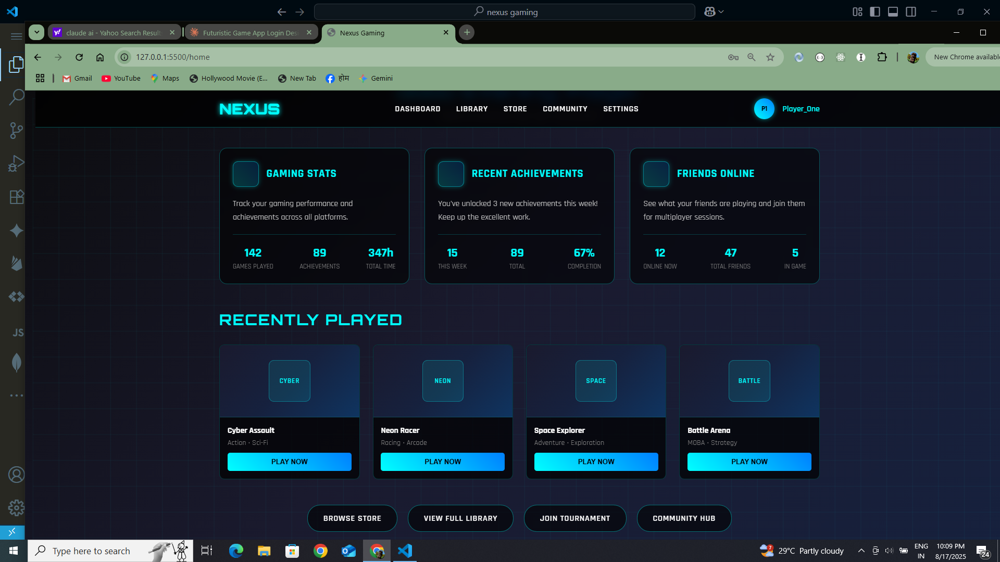

# Nexus Gaming

This project demonstrates a simple web application for Nexus Gaming, featuring a login page and a homepage, with client-side routing.

## Demo

To run the demo:
1.  Clone this repository: `git clone https://github.com/iamvivek1/nexus_gaming.git`
2.  Navigate to the project directory: `cd nexus_gaming`
3.  Open `index.html` in your web browser.

You will initially see the login page. After clicking the "Initialize Connection" button, you will be redirected to the homepage.

## Showcase

  
   <em>Screenshot 1</em>  
  
   <em>Screenshot 2</em>  
  
   <em>Screenshot 3</em>  

